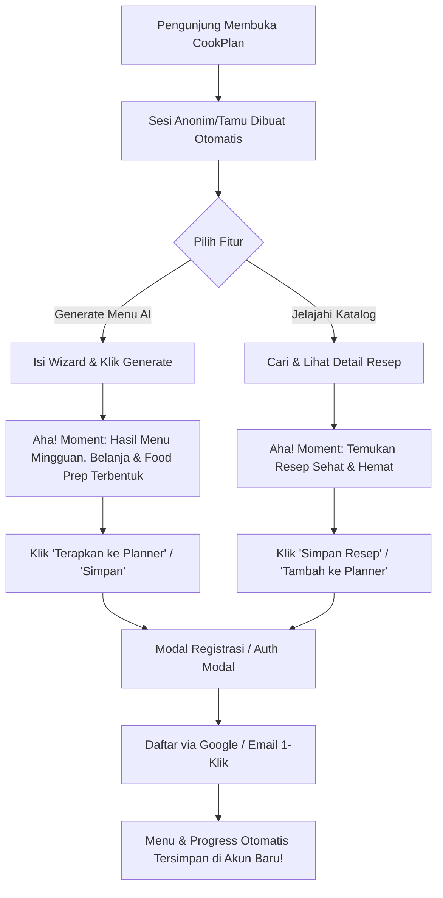

# Product Requirement Document (PRD)
## Kurangi Friction Onboarding & Optimasi "Aha! Moment" Pengunjung CookPlan

---

### 1. Ringkasan Eksekutif (Executive Summary)
**CookPlan** adalah aplikasi *meal planning*, otomatisasi daftar belanja, dan *food prep* berbasis AI untuk PKM-K 2026. Berdasarkan evaluasi akuisisi pengguna, hambatan utama (friction) pengunjung baru dalam mencoba CookPlan adalah keharusan untuk membuat akun/login terlalu awal sebelum mereka memahami atau merasakan manfaat aplikasi.

PRD ini bertujuan merombak alur *first impression* dengan menerapkan strategi **Product-Led Growth (PLG) / Try-Before-Register**: pengunjung web (calon pengguna) dapat langsung menggunakan AI Meal Generator dan menjelajahi Katalog Resep secara gratis tanpa registrasi. Setelah merasakan nilai utama aplikasi ("Aha! Moment"), barulah pengguna diajak mendaftar untuk menyimpan progres mereka.

---

### 2. Latar Belakang & Pernyataan Masalah (Problem Statement)

> **Masalah**: Pengunjung yang didatangkan dari kegiatan marketing/sosial media sering batal mencoba aplikasi (*drop-off*) ketika terhalang tembok login/register di awal. 
> 
> **Dampak**: Tingkat konversi calon pengunjung menjadi pengguna aktif (real user) rendah karena calon pengguna belum melihat keunggulan CookPlan secara langsung.

#### Prinsip Solusi:
1. **Zero-Friction Access**: Pengunjung baru yang masuk ke CookPlan langsung diarahkan ke fitur utama (AI Generator & Katalog Resep) dalam **Mode Tamu (Guest Mode)**.
2. **Visual & Interactive "Aha! Moment"**: Tamu dapat menyusun rencana makan mingguan berbasis budget/pantry dan melihat daftar belanja otomatis yang dihasilkan oleh AI CookPlan secara instan.
3. **Soft-Gated Conversion**: Ajakan mendaftar (CTA Registrasi) ditempatkan secara alami tepat ketika calon pengguna ingin menyimpan hasil menu ke jadwal mingguan atau menyimpan resep favorit.

---

### 3. Tujuan & Indikator Keberhasilan (OKRs & Metrics)

* **Tujuan Utama**: Memaksimalkan akumulasi *real user* dengan memberikan pengalaman visual & interaktif terbaik pada kunjungan pertama.
* **Target Metrik Keberhasilan**:
  1. **Conversion Rate (Visitor to Registered User)**: Target peningkatan hingga **> 35%**.
  2. **First-Time Aha! Completion Rate**: **> 70%** tamu menyelesaikan proses generate menu AI pertama mereka.
  3. **Bounce Rate**: Penurunan *bounce rate* halaman pertama sebesar **> 40%**.

---

### 4. Detail Fitur & Spesifikasi Pengalaman Pengguna (User Experience & Features)

#### Fitur 1: Navigasi Mode Tamu Tanpa Batas (Seamless Guest Navigation)
* **Deskripsi**: Menyediakan akses navigasi jernih bagi tamu untuk menjelajahi aplikasi baik di Desktop maupun Mobile.
* **Kebutuhan UI/UX**:
  * **Desktop Top Nav**: Menampilkan menu **Generate** (`/generate`) dan **Katalog** (`/catalog`) untuk pengguna tamu, disandingkan dengan tombol CTA utama **"Daftar / Masuk"**.
  * **Mobile Bottom Nav**: Menampilkan bottom nav bar 3 tab untuk pengguna tamu: `Generate` (AI), `Katalog`, dan `Daftar / Masuk`.
  * **Guest Teaser Banner**: Menampilkan banner subtle di bagian paling atas layar:
    > *"✨ **Mode Uji Coba**: Coba susun menu AI & jelajahi katalog sepuasnya tanpa perlu mendaftar! [Daftar Gratis]"*

#### Fitur 2: Eksplorasi Katalog Resep Terbuka (Public Recipe Catalog)
* **Deskripsi**: Tamu dapat mencari, memfilter (berdasarkan preferensi diet, waktu masak ≤15/30 mnt, budget hemat/standar/premium), serta membaca detail resep lengkap.
* **Soft-Gating Trigger**:
  * Jika tamu menekan ikon **Bookmark (Simpan)**, **Suka (Like)**, atau **Tambah ke Planner**: Tampilkan Modal Interaktif ramah:
    > *"Ingin menyimpan resep ini? Buat akun gratis dalam sekejap untuk menyimpan resep favorit dan menyusun jadwal makan mingguanmu!"*
    > [Daftar Akun Gratis] [Nanti Saja]

#### Fitur 3: Pengalaman "Aha! Moment" Hasil Generate AI (High-Converting AI Meal Plan)
* **Deskripsi**: Tamu dapat mengisi wizard generate (durasi, porsi, waktu makan, diet, budget, sisa bahan di kulkas) dan menjalankan AI generator secara gratis (hingga batas 2x percobaan gratis per sesi tamu).
* **High-Converting CTA**:
  * Setelah hasil menu AI siap, tamu dapat melihat ringkasan menu harian, total estimasi budget belanja, daftar bahan makanan, dan panduan food prep.
  * Tepat di bawah hasil generate, tampilkan **Aha! Conversion Card**:
    > *"🎉 Suka dengan Rencana Makan Ini? Daftar akun gratis sekarang untuk menyimpan rencana ini ke Planner Mingguan dan mendapatkan Checklist Belanja Otomatis!"*
    > [Daftar Akun Gratis (10 Detik)]
  * Tombol **"Terapkan ke Planner"** pada layar hasil tamu akan membuka Modal Konversi yang membawa lokasi asal (`location.state.from`) ke halaman `/auth`. Setelah login/daftar sukses, hasil rencana otomatis diimpor/diterapkan ke Planner pengguna.

---

### 5. Alur Pengguna (User Journey Diagram)

---

### 6. Arsitektur Teknis & Keamanan (Technical Architecture)

1. **Session & Auth Handling (`src/components/ProtectedRoute.jsx`)**:
   * Memanfaatkan Supabase Anonymous Sign-In (`signInAnonymously`).
   * Rute publik & coba-tamu: `/generate`, `/generate/:planId`, dan `/catalog`.
   * Rute terproteksi (butuh akun penuh): `/planner`, `/shopping`, `/profile`, `/order/*`.

2. **Preservasi State & Auto-Apply (`src/pages/AuthPage.jsx`)**:
   * Menyimpan `planId` hasil generate tamu di `sessionStorage`.
   * Saat registrasi/login berhasil, `AuthPage` mengecek keberadaan pending plan dan otomatis mengimpor menu tersebut ke akun baru pengguna tanpa perlu generate ulang!

3. **Batas Penggunaan Sesi Tamu (Guest Quota Control)**:
   * Sisa percobaan gratis untuk tamu dibatasi sebanyak **2x** per sesi tamu (Edge Function validate & `getGuestUsageCount`).
   * Mengedukasi tamu secara transparan tentang sisa percobaan gratis mereka tanpa mengintimidasi.

---

### 7. Rencana Pelaksanaan (Implementation Plan)

- [x] **Tahap 1**: Buat git branch `feature/onboarding-friction-reduction` dan dokumen PRD.
- [ ] **Tahap 2**: Update `AppShell.jsx` (Navigasi Desktop/Mobile & Guest Mode Top Banner).
- [ ] **Tahap 3**: Update `RecipeCatalog.jsx` (Public exploration & Soft-gating Auth Modal for Save/Like/Plan).
- [ ] **Tahap 4**: Update `GeneratePlan.jsx` & `GenerateResult.jsx` (Guest experience enhancement & High-Converting CTA Card).
- [ ] **Tahap 5**: Uji coba & verifikasi seluruh flow dari tamu -> generate -> register -> auto-apply planner.

---
*Dokumen ini disusun untuk mengawal pengembangan CookPlan PKM-K 2026.*
