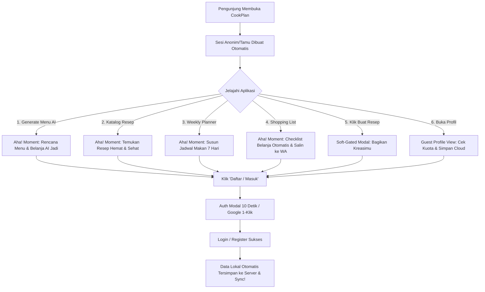

# Product Requirement Document (PRD)
## Kurangi Friction Onboarding & Optimasi "Aha! Moment" Pengunjung CookPlan

---

### 1. Ringkasan Eksekutif (Executive Summary)
**CookPlan** adalah aplikasi *meal planning*, otomatisasi daftar belanja, dan *food prep* berbasis AI untuk PKM-K 2026. Berdasarkan evaluasi akuisisi pengguna, hambatan utama (*friction*) pengunjung baru dalam mencoba CookPlan adalah keharusan untuk membuat akun/login terlalu awal sebelum mereka memahami atau merasakan manfaat aplikasi.

PRD ini bertujuan merombak alur *first impression* dengan menerapkan strategi **Product-Led Growth (PLG) / Try-Before-Register**: pengunjung web (calon pengguna) dapat langsung mencoba **seluruh core offer CookPlan** (AI Meal Generator, Katalog Resep, Rencana Masak Mingguan, dan Checklist Belanja Otomatis) secara gratis tanpa mendaftar. Setelah merasakan nilai utama aplikasi ("Aha! Moment"), barulah pengguna diajak mendaftar untuk menyimpan progres mereka secara permanen di server.

---

### 2. Latar Belakang & Pernyataan Masalah (Problem Statement)

> **Masalah**: Pengunjung yang didatangkan dari kegiatan marketing/sosial media sering batal mencoba aplikasi (*drop-off*) ketika terhalang tembok login/register di awal. 
> 
> **Dampak**: Tingkat konversi calon pengunjung menjadi pengguna aktif (*real user*) rendah karena calon pengguna belum melihat keunggulan CookPlan secara langsung.

#### Prinsip Solusi:
1. **Zero-Friction Access**: Pengunjung baru yang masuk ke CookPlan langsung diberikan akses penuh ke seluruh fitur utama (**Generate AI**, **Katalog**, **Planner**, **Belanja**, dan **Profil Tamu**) dalam **Mode Tamu (Guest Mode)**.
2. **Visual & Interactive "Aha! Moment"**: Tamu dapat menyusun rencana makan mingguan, melihat daftar belanja otomatis yang dapat dicentang, serta mengeksplorasi resep masakan secara instan.
3. **Soft-Gated Conversion di Semua Fitur**: Ajakan mendaftar (CTA Registrasi) ditempatkan secara alami dan elegan tanpa ada *dead end* atau *hard redirect*, termasuk saat tamu mengakses fitur Buat Resep dan Halaman Profil.

---

### 3. Matriks Fitur Mode Tamu (Guest Mode Feature Matrix)

| Fitur | Status Guest Mode | Pengalaman Pengguna (UX) Tamu | Triger Konversi (Auth Required) |
| :--- | :---: | :--- | :--- |
| **Susun Menu AI (`/generate`)** | 🔓 Terbuka | Bebas atur wizard & buat rencana menu AI (hingga 2x kuota gratis per sesi tamu). | Menampilkan CTA Registrasi di halaman hasil untuk simpan permanen. |
| **Katalog Resep (`/catalog`)** | 🔓 Terbuka | Bebas cari resep, filter diet/waktu/harga, dan baca panduan langkah masak lengkap. | Menampilkan Auth Modal saat menekan **Bookmark (Simpan)** atau **Like (Suka)**. |
| **Rencana Masak (`/planner`)** | 🔓 Terbuka | Bebas atur jadwal makan 7 hari (Senin–Minggu). Data tersimpan lokal di browser (`localStorage`). | Menampilkan banner edukasi: *"Daftar akun gratis agar jadwal makanmu tersimpan permanen & tidak hilang."* |
| **Daftar Belanja (`/shopping`)** | 🔓 Terbuka | Bebas lihat checklist belanja otomatis dari planner, centang bahan, & salin ke WA/Clipboard. | Menampilkan Auth Modal saat menekan **Simpan ke Server** atau **Checkout Pesanan Paket**. |
| **Buat Resep (`/recipes/create`)** | 🪟 Soft-Gated | Tamu melihat tombol & entri "Buat Resep" di Katalog/Navigasi. Saat diklik, muncul modal ajakan mendaftar. | *"Bagikan resep kreasi sehatmu ke komunitas CookPlan! Daftar akun gratis dalam 10 detik."* |
| **Halaman Profil (`/profile`)** | 🪟 Soft-Gated | Tamu dapat membuka tab Profil dan melihat **Layar Profil Tamu (Guest Profile)** berisi info sisa kuota AI & status simpan lokal. | Kartu konversi utama: *"Daftar Akun Gratis untuk Menyimpan Semua Data ke Cloud & Bebas Batas Kuota!"* |
| **Panel Admin (`/admin/*`)** | 🔒 Terkunci | Hanya untuk admin terdaftar (RLS). | Access denied / login admin. |

---

### 4. Detail Fitur & Spesifikasi Pengalaman Pengguna (User Experience & Features)

#### Fitur 1: Navigasi Full-Access untuk Tamu (Seamless Guest Navigation)
* **Deskripsi**: Menyediakan navigasi 5 tab lengkap bagi tamu baik di Desktop maupun Mobile.
* **Kebutuhan UI/UX**:
  * **Desktop Top Nav**: Menampilkan menu **Generate** (`/generate`), **Katalog** (`/catalog`), **Rencana** (`/planner`), **Belanja** (`/shopping`), **Profil** (`/profile`), dan tombol CTA **"Daftar / Masuk"**.
  * **Mobile Bottom Nav**: Menampilkan bottom nav bar 5 tab penuh untuk tamu (`Generate`, `Katalog`, `Rencana`, `Belanja`, `Profil`).
  * **Guest Teaser Banner**: Menampilkan banner subtle di bagian paling atas layar:
    > *"✨ **Mode Uji Coba**: Kamu sedang mencoba Mode Tamu! Coba fitur AI, Katalog, Planner &amp; Belanja sepuasnya. [Daftar Akun Gratis]"*

#### Fitur 2: Soft-Gated Conversion pada Buat Resep (`/recipes/create`)
* **Deskripsi**: Ketika tamu mengeklik tombol "Buat Resep" di Katalog Resep atau Navigasi, jangan langsung *redirect* paksa ke layar login kosong.
* **Tampilan Modal**:
  * Judul: *"Buat &amp; Bagikan Resep Sehatmu 🎉"*
  * Deskripsi: *"Daftar akun gratis dalam 10 detik untuk menulis resep kreasimu, membagikannya ke komunitas CookPlan, dan menyimpan draf masakan favorit."*
  * Tombol CTA: **[Daftar / Masuk Akun]** & **[Nanti Saja]**.

#### Fitur 3: Halaman Profil Tamu Interaktif (`/profile`)
* **Deskripsi**: Pengguna tamu yang mengeklik tab Profil akan melihat tampilan profil khusus tamu (Guest Profile View) yang menarik dan edukatif.
* **Komponen Layar Profil Tamu**:
  1. **Header Avatar Tamu**: *"Tamu Spesial CookPlan ✨"*
  2. **Indikator Kuota Tamu**: Menampilkan sisa kuota percobaan gratis AI generate (mis. 2 dari 2 tersisa).
  3. **Indikator Penyimpanan Lokal**: Status penyimpanan lokal peramban (*localStorage* aktif).
  4. **High-Converting Hero Card**:
     > *"Simpan Semua Rencana &amp; Resepmu di Cloud!"*
     > *"Daftar akun gratis sekarang agar kamu dapat mengakses jadwal makan dan daftar belanja dari laptop &amp; HP mana saja tanpa takut hilang."*
     > **[Daftar / Masuk via Google atau Email]**

#### Fitur 4: Rencana Masak & Belanja Lokal (Local Planner & Shopping Checklist)
* **Deskripsi**: Tamu dapat mengedit jadwal makan dan melihat daftar belanjaan yang diperbarui secara *real-time* di peramban (*localStorage*).
* **High-Converting CTA**:
  * Di bagian atas halaman Planner & Shopping untuk tamu, tampilkan banner pengingat ramah:
    > *"💡 Rencana &amp; daftar belanjamu tersimpan sementara di perangkat ini. **Daftar akun gratis** agar dapat diakses dari HP &amp; laptop mana saja!"*

---

### 5. Alur Pengguna (User Journey Diagram)

---

### 6. Arsitektur Teknis & Keamanan (Technical Architecture)

1. **Routing (`src/App.jsx`)**:
   * Pindahkan `/planner`, `/shopping`, `/profile`, dan `/recipes/create` ke rute `allowAnonymous`:
     `<Route element={<ProtectedRoute allowAnonymous />}>` untuk rute-rute publik & coba-tamu.
2. **Local Persistence (`src/context/PlanContext.jsx`)**:
   * `PlanContext` mendukung penyimpanan `localStorage` per minggu (`weeklyPlan:YYYY-MM-DD`) secara otomatis saat user belum login / tamu.
3. **Pending Data Sync (`src/pages/AuthPage.jsx`)**:
   * Saat registrasi/login berhasil, data dari `localStorage` & pending action otomatis diimpor ke akun Supabase pengguna tanpa ada data yang hilang.

---

### 7. Rencana Pelaksanaan (Implementation Plan)

- [x] **Tahap 1**: Buat git branch `feature/onboarding-friction-reduction` dan perbarui dokumen PRD lengkap.
- [ ] **Tahap 2**: Update `App.jsx` (Buka rute `allowAnonymous` untuk `/generate`, `/catalog`, `/planner`, `/shopping`, `/profile`, `/recipes/create`).
- [ ] **Tahap 3**: Update `AppShell.jsx` (Tampilkan navigasi 5-tab penuh & Guest Top Banner).
- [ ] **Tahap 4**: Update `RecipeCatalog.jsx` (Soft-gated modal untuk Save/Like/Add to Plan/Create Recipe).
- [ ] **Tahap 5**: Update `UserProfile.jsx` (Tambahkan **Guest Profile View** khusus pengguna tamu).
- [ ] **Tahap 6**: Update `GeneratePlan.jsx` & `GenerateResult.jsx` (Conversion card & auto-apply trigger).
- [ ] **Tahap 7**: Update `WeeklyPlanner.jsx` & `ShoppingList.jsx` (Banner edukasi penyimpanan lokal & soft-gated checkout/save).
- [ ] **Tahap 8**: Uji coba komprehensif & commit perubahan.

---
*Dokumen ini disusun untuk mengawal pengembangan CookPlan PKM-K 2026.*
